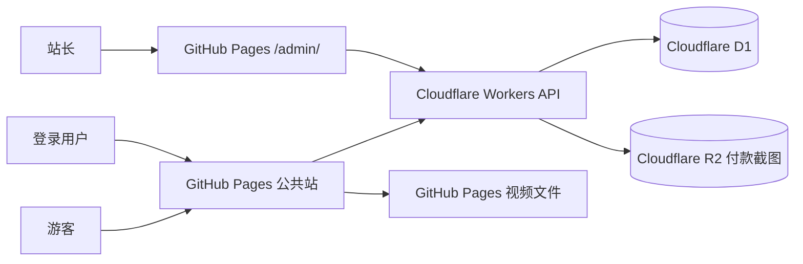

# 某不知名有用的网站：第一期设计规格

- 日期：2026-09-12
- 状态：已完成设计讨论，等待用户审阅
- 第一期范围：综合资源站基础框架、火影课程、账号系统、付款审核、站长后台
- 部署目标：GitHub Pages + Cloudflare 免费套餐

## 1. 产品目标

网站公开名称为“某不知名有用的网站”。第一期以火影课程作为首个付费内容，同时建立能够继续增加课程、工具服务、会员权益、数字资源和其他付费功能的基础设施。

第一期需要实现：

- 游客可以浏览网站和资源介绍。
- 用户注册并登录自己的账号。
- 用户通过课程专属密码，或者通过收款码付款并由管理员审核，获得课程权限。
- 用户可以跨设备查看已拥有内容并同步观看进度。
- 管理员可以审核付款申请、管理用户和查看分类收入及总收入。
- 网站保持 0 元/月的首期部署成本，在早期免费额度范围内运行。

成功标准：

- 普通用户可以从注册开始，完成课程密码解锁或付款申请，最终进入课程播放页。
- 管理员可以独立查看订单、截图、用户和收入，不需要直接修改数据库。
- 第二套课程可以在不修改账号、订单和播放器底层逻辑的情况下加入。
- 公共站与站长后台共用后端和数据库，但拥有独立入口和界面。

## 2. 第一期范围与边界

### 2.1 第一期包含

- 公共首页及参考 API Hub 的通用信息布局。
- 火影课程总页。
- 超影课程、暗部课程和火影合集的产品配置。
- 账号注册、登录、找回密码和联系方式绑定。
- 课程密码永久解锁。
- 收款码付款、付款截图提交和人工审核。
- 视频在线播放、下载、课程列表和观看进度。
- 用户中心。
- 独立站长后台。
- 按产品分类的收入账本和汇总。
- 异常登录提示。
- 响应式桌面和手机界面。
- GitHub Pages、Cloudflare Workers、D1 和 R2 部署。

### 2.2 第一期不包含

- 在线支付接口和自动到账回调。
- 自动退款和订单取消。
- 短信验证码和邮件验证码。
- VPN、第三方账号共享、会员代购等具体经营业务。
- 复杂的视频加密、防盗链和绝对防下载。
- 多商家、多租户和分账系统。
- 原生移动应用。

未来涉及 VPN、第三方平台账号、优惠额度或代购的业务，在上线前必须单独进行平台规则和适用法律审查。第一期规格不为这些业务提供合规结论。

## 3. 总体架构

组件职责：

- **公共站**：展示资源目录、课程详情、账号页面、付款申请和视频播放器。
- **站长后台**：审核订单、管理用户、查看异常登录和收入统计。
- **Workers API**：所有账号、权限、订单、进度和管理操作的服务端入口。
- **D1**：保存结构化数据。
- **R2**：私有保存付款截图。
- **GitHub Pages 媒体目录**：保存并分发课程视频文件。

技术栈：

- 前端：Vite、React、TypeScript、React Router。
- 后端：Cloudflare Workers、TypeScript。
- 数据：Cloudflare D1、Cloudflare R2。
- 部署：GitHub Pages、Wrangler。
- 测试：Vitest、Cloudflare Workers 本地运行环境、Playwright。

第一期使用哈希路由，保证 GitHub Pages 刷新子页面时不会返回 404。公共站从仓库根路径部署，站长端从 `/admin/` 部署。

## 4. 用户角色与权限

| 角色 | 权限 |
| --- | --- |
| 游客 | 浏览首页、资源列表、产品介绍、价格、购买说明和基础内容页 |
| 登录用户 | 使用课程密码、提交付款申请、查看用户中心、观看已解锁内容、下载视频、同步进度 |
| 超级管理员 | 审核订单、修改实际到账金额、管理用户、重置密码、解绑联系方式、查看收入与异常登录 |

权限原则：

- 游客只能浏览公开介绍，不能进入播放页、用户中心、付款申请和下载地址操作界面。
- 登录只证明账号身份，不等于已经购买任何产品。
- 拥有权限由服务端权益记录决定，不能仅由前端状态决定。
- 管理员接口必须在服务端校验管理员角色。
- 公共导航不展示站长后台入口，但后台地址可以被知道，安全性依靠身份和角色校验，而不是隐藏地址。

## 5. 页面与信息架构

### 5.1 公共网站

1. 首页
   - 顶部品牌导航。
   - 居中大标题、说明文字和资源搜索框。
   - 桌面端左侧分类、右侧资源卡片。
   - 手机端分类横向滑动、资源卡片单列。
   - 资源卡片可以显示“热门”“免费”“规划中”“已上线”等状态。

2. 火影课程总页
   - 展示超影课程、暗部课程和火影合集。
   - 展示各自价格、包含内容、上线状态和购买权益。
   - 提供“使用课程密码”和“购买课程”两个入口。
   - 合集可以预售，并明确提示暗部课程上线后自动解锁。

3. 课程详情页
   - 展示课程介绍、视频数量、学习方式和购买状态。
   - 未解锁时显示课程密码输入框和购买入口。
   - 已解锁时显示视频列表、总进度和继续观看入口。

4. 视频播放页
   - 展示当前视频播放器、课程视频列表和下载按钮。
   - 默认在线播放，下载作为次级入口。
   - 自动恢复上次观看位置。

5. 登录与注册页
   - 用户名、密码为必填项。
   - 手机号和邮箱为选填项。
   - 注册成功后进入用户中心。

6. 找回密码页
   - 输入用户名和已绑定手机号或邮箱。
   - 匹配成功即可设置新密码。
   - 不发送验证码。

7. 用户中心
   - 已拥有课程和“继续观看”。
   - 已解锁但尚未上线的课程。
   - 付款申请状态。
   - 账号资料、密码和联系方式管理。

8. 付款申请页
   - 产品、标价、收款码和订单号。
   - 付款时间、联系方式和付款截图。
   - 提交后显示“待审核”，并允许查看审核结果。

9. 基础内容页
   - 关于网站、购买说明、联系方式、用户协议、隐私说明和免责声明。

### 5.2 站长后台

1. 仪表盘
   - 总收入、本月收入、今日收入。
   - 待审核金额与数量。
   - 用户总数、新增用户、付费用户和复购用户。
   - 最近 30 天收入趋势。
   - 最近订单与异常登录。

2. 订单审核
   - 待审核、已通过、已拒绝列表。
   - 查看用户、产品、标价、实际到账金额、付款时间和付款截图。
   - 通过或拒绝订单。
   - 编辑实际到账金额、付款时间和备注。

3. 用户管理
   - 查看账号状态、绑定状态、最后登录时间、已拥有产品和观看进度。
   - 重置密码、解绑联系方式、调整权益。
   - 查看异常登录记录。

4. 收入统计
   - 网站总收入。
   - 每个产品的独立收入与销量。
   - 每个分类的合计收入。
   - 免费产品的使用量与付费产品销量分别展示。

5. 审计记录
   - 金额修改、订单审核、权益变更和用户管理操作全部留痕。

## 6. 视觉设计

公共网站和站长后台使用同一套品牌基础，但布局目的不同。

公共网站：

- 第一版参考 API Hub 的通用排版骨架：顶部导航、居中大标题、搜索框、左侧分类、右侧卡片。
- 第一版先采用参考站相近的红蓝紫配色，所有颜色、阴影、圆角和字体通过主题变量管理。
- 只借鉴通用布局，不使用 Apifox 的 Logo、品牌名称、独特插画、图标、源代码、文案或像素级视觉细节。
- 不采用忍者、卷轴、忍术纹样、动漫人物或其他火影视觉元素。
- 页面风格以精品、干净、专业和容易扩展为目标。
- 桌面端优先展示两列资源卡片，手机端改为单列。

站长后台：

- 桌面优先，信息密度高于公共网站。
- 使用侧边导航、统计卡片、趋势图、数据表格和订单详情抽屉。
- 手机端只保证查看订单、通过审核和查看核心收入数据。

## 7. 核心用户流程

### 7.1 注册与登录

1. 用户填写用户名和密码，可选填手机号或邮箱。
2. 服务端检查用户名以及联系方式是否已被占用。
3. 服务端保存密码哈希和联系方式不可逆匹配值。
4. 注册成功后创建默认用户会话并进入用户中心。
5. 新登录成功后，旧会话立即失效，账号最多保留一个有效登录。

### 7.2 课程密码解锁

1. 用户进入课程页并点击“使用课程密码”。
2. 未登录时先完成登录或注册，并返回原课程。
3. 用户输入超影或暗部课程密码。
4. 服务端校验密码哈希和尝试频率。
5. 校验成功后创建永久权益，并记录开通来源为课程密码。
6. 用户以后登录即可直接进入课程，不再重复输入。

### 7.3 收款码购买

1. 登录用户选择产品并进入付款申请页。
2. 服务端生成订单号，格式为 `HY-YYYYMMDD-` 加 4 位大写字母或数字。
3. 页面显示收款码、金额和订单号，提示用户在转账备注中填写订单号。
4. 用户付款后填写付款时间、联系方式，并上传截图。
5. 截图上传到私有 R2，订单状态设为待审核。
6. 管理员在站长后台核对截图和实际收款后，将订单改为通过或拒绝。
7. 通过时创建对应权益；拒绝时保存原因供用户查看。

收款码付款不会自动通知系统。订单收入以管理员填写的实际到账金额为准。

### 7.4 火影合集预售

- 火影合集售价 49 元，包含超影课程和暗部课程。
- 暗部课程尚未上线时仍可购买。
- 审核通过后立即创建超影课程与暗部课程权益。
- 暗部课程在用户中心显示“已拥有，等待上线”。
- 暗部课程上线后，用户无需再次购买或审核即可观看。

### 7.5 视频观看与进度

1. 播放页先从服务端加载课程清单、权益和上次进度。
2. 播放器打开后将进度跳转到上次位置。
3. 播放中每 2 分钟同步一次进度。
4. 暂停、切换视频和离开页面时立即同步。
5. 离线时先保存到本地队列，恢复网络后再同步。
6. 播放超过视频总时长的 95% 时标记为已完成。
7. 再次打开已经完成的视频时从头播放或询问是否重新播放。

### 7.6 找回密码

- 输入用户名和一个已绑定联系方式。
- 用户名和联系方式全部匹配后，允许设置新密码。
- 重置成功后退出所有旧会话。
- 未绑定手机号和邮箱且忘记密码的用户，不能自行找回，只能注册新账号；管理员可以在特殊情况下人工处理。
- 找回接口根据用户名和 IP 限速，避免批量猜测。

### 7.7 异常登录警告

- 每次成功登录记录 IP 的不可逆哈希、国家、城市和 Cloudflare 机房信息。
- 不向普通用户或公众显示完整 IP。
- 同一账号 24 小时内出现 3 个不同 IP，弹出一级提醒。
- 同一账号 24 小时内出现 5 个不同 IP，或出现不同国家或地区登录，弹出加强提醒。
- 同一提醒在短时间内不重复弹出。
- 系统只警告，不自动封号、不冻结订单、不阻止购买。
- 手机网络或 VPN 可能产生误报，因此异常提示只用于提醒和站长参考。

## 8. 产品与课程配置

| 产品 | 售价 | 第一期状态 | 权益 |
| --- | --- | --- | --- |
| 超影课程 | 29 元 | 已上线 | 9 个视频、在线播放、下载、进度同步 |
| 暗部课程 | 29 元 | 待上线 | 素材到位后配置视频与课程密码 |
| 火影合集 | 49 元 | 可预售 | 超影课程权益加暗部课程权益 |

课程数据规则：

- 超影课程现有 9 个 MP4，总体积约 0.41 GB，单个文件不超过 100 MB。
- 第一批视频标题默认使用“第 1 课”至“第 9 课”，后续可以替换为正式标题。
- 视频文件继续存放在 GitHub Pages 仓库中。
- 视频地址可能被技术用户发现，第一期接受该风险。
- 每个系列拥有独立的课程密码。
- 火影合集审核通过时直接创建两个系列权益，同时也可向私下付款的用户发放两组课程密码。

## 9. 账号与联系方式规则

账号字段：

- 用户名：唯一、必填、可公开。
- 密码：必填，只保存不可逆哈希。
- 手机号：选填，一个手机号只能绑定一个账号。
- 邮箱：选填，一个邮箱只能绑定一个账号。
- 联系方式匹配值：使用服务端密钥生成的 HMAC，用于精确匹配，不保存可直接检索的明文索引。
- 联系方式脱敏值：用于用户中心显示，例如 `138****1234` 和 `ab***@qq.com`。
- 预留 `phone_verified_at` 和 `email_verified_at`，方便以后增加验证码。

联系方式按先绑定者优先。由于第一期不发送验证码，联系方式不视为已确认所有权；管理员可以人工解绑。

账号安全：

- 登录、找回密码和课程密码接口均限速。
- 用户修改密码后，所有旧会话失效。
- 管理员重置密码后，被重置账号的所有旧会话失效。
- 登录会话使用服务端可撤销的随机令牌；前端只在请求中携带，不把管理员密钥写入页面。
- 密码哈希和会话令牌不写进日志。

## 10. 付款、订单与权益

订单状态：

- `pending`：已提交，等待审核。
- `approved`：已确认到账，权益已创建。
- `rejected`：未通过审核，记录拒绝原因。

付款申请字段：

- 订单号。
- 用户。
- 产品。
- 产品标价。
- 实际到账金额。
- 付款时间。
- 用户填写的联系方式。
- 私有付款截图。
- 审核状态、审核人、审核时间和备注。

付款规则：

- 默认实际到账金额等于标价。
- 管理员审核时可以修改实际到账金额。
- 收入只统计已通过订单的实际到账金额。
- 待审核订单不计入收入。
- 拒绝订单不计入收入。
- 所有金额修改保留修改前值、修改后值、操作人和时间。

权益字段：

- 用户。
- 产品。
- 状态。
- 开通来源：课程密码、订单审核或管理员手动开通。
- 关联订单。
- 开通时间。
- 到期时间；第一期默认永久，字段为空。

## 11. 数据模型

第一期使用以下核心表：

| 表 | 用途 |
| --- | --- |
| users | 用户名、密码哈希、角色、状态、联系方式匹配值和脱敏值 |
| sessions | 当前有效会话、设备摘要、创建时间和最后活动时间 |
| products | 产品名称、价格、状态、分类和排序 |
| series | 课程系列、课程密码哈希、上线状态 |
| lessons | 视频标题、文件地址、所属系列和排序 |
| entitlements | 用户拥有的产品与开通来源 |
| payment_claims | 付款申请、订单号、截图地址、审核和实际到账金额 |
| watch_progress | 用户、视频、播放位置、总时长、完成状态和更新时间 |
| login_events | 登录时间、IP 哈希、国家、城市、机房和异常等级 |
| audit_logs | 管理员操作、前后值和操作时间 |

关键约束：

- 用户名唯一。
- 手机号匹配值唯一。
- 邮箱匹配值唯一。
- 订单号唯一。
- 同一用户和产品只保留一条有效权益。
- 同一用户和视频只保留一条观看进度。
- 删除账号时采用禁用而不是物理删除，避免订单和审计记录失去关联。

## 12. API 边界

公共 API：

- 注册、登录、退出和获取当前用户。
- 修改密码和找回密码。
- 获取资源目录、产品、系列和课程介绍。
- 使用课程密码解锁产品。
- 创建付款申请和上传付款截图。
- 查看本人订单状态和权益。
- 读取和更新本人观看进度。

管理员 API：

- 查询和审核付款申请。
- 修改实际到账金额和付款时间。
- 查询用户并管理权益。
- 重置密码和解绑联系方式。
- 查询收入汇总、产品收入、趋势和审计日志。
- 查询异常登录记录。

所有需要登录的接口必须同时校验会话和资源权限。前端隐藏按钮不算权限控制。

## 13. 错误处理

| 场景 | 用户体验 |
| --- | --- |
| 用户名或联系方式被占用 | 明确指出冲突字段，不清空其他输入 |
| 登录过期 | 保留目标页面，重新登录后返回 |
| 课程密码错误 | 显示错误与剩余尝试次数，不泄露正确密码信息 |
| 找回信息不匹配 | 使用统一提示，避免暴露账号是否存在 |
| 截图格式或大小错误 | 保留表单内容，允许重新选择 |
| 截图上传失败 | 订单不创建，允许重新提交 |
| API 暂时不可用 | 显示重试入口，不将权益误判为不存在 |
| 视频加载失败 | 提供重新加载和下载入口 |
| 权限不足 | 显示课程密码和购买入口，不显示视频地址 |
| 管理员操作失败 | 保留当前页面和输入，提示失败原因 |

## 14. 站长收入与统计

收入名称统一使用“网站已确认收入”，不宣称是支付平台自动同步的实时收入。

仪表盘指标：

- 总收入。
- 本月收入。
- 今日收入。
- 待审核金额。
- 按产品收入。
- 按产品销量。
- 按分类合计收入。
- 用户总数、新增用户、付费用户和复购用户。
- 最近 30 天收入趋势。
- 最近订单和异常登录。

随着后续产品增加，每个产品拥有独立编号和分类，因此可以同时查看单项和总计。免费产品不计收入，只记录使用量。

管理员角色：

- 超级管理员：全部权限。
- 客服管理员：第一期不启用；未来只能审核订单和查看用户，不能修改收入。

## 15. 免费额度与容量假设

以下为规划估算，开通服务时必须以 Cloudflare 和 GitHub 的最新额度为准。

| 服务 | 规划额度 | 早期能力估算 |
| --- | --- | --- |
| Workers 请求 | 约 10 万次/天 | 100 人各看 2 小时并按分钟同步时约使用 1.2 万次 |
| D1 写入 | 约 10 万行/天 | 每 2 分钟同步时，约支持 1600 人各看 2 小时 |
| D1 存储 | 约 5 GB | 用户、订单、权益和进度数据远低于上限 |
| R2 存储 | 约 10 GB/月 | 当前视频约 0.41 GB；付款截图通常每张低于 8 MB |
| GitHub Pages 带宽 | 约 100 GB/月软限制 | 每套视频约 0.41 GB，完整下载和在线播放共同消耗 |

扩展原则：

- 视频直接从 GitHub Pages 加载，不让 Workers 转发视频范围请求。
- 观看进度每 2 分钟同步，避免高频写入。
- 静态页面尽量使用浏览器缓存。
- 达到免费额度或国内访问明显不稳定时，再迁移到预算范围内的服务器或对象存储。

## 16. 部署方案

### 16.1 公共站

- 代码发布到 GitHub 仓库。
- 使用 GitHub Pages 部署 Vite 构建结果。
- 支持仓库子路径部署。
- 第一期使用哈希路由。
- 视频放在公共媒体目录。

### 16.2 站长后台

- 与公共站同一仓库构建，入口为 `/admin/`。
- 公共导航不显示后台入口。
- 数据接口与公共站共用 Workers。
- 以后需要独立域名时，将站长端构建产物部署到新域名，并复用同一 API。

### 16.3 Cloudflare

- Workers 提供 API。
- D1 使用迁移脚本创建和升级表结构。
- R2 使用私有存储桶保存付款截图。
- Worker 密钥、密码盐和签名密钥通过 Cloudflare Secret 管理。
- 生产环境限制 CORS 只允许正式 GitHub Pages 地址和管理域名。

### 16.4 数据备份

- 提供管理员数据导出，包含用户、订单、权益和进度。
- D1 使用平台提供的备份或时间点恢复能力。
- R2 中的付款截图定期下载到另一份本地或云端备份。
- 数据库结构和 API 不绑定 Cloudflare 专有 SDK 语义，便于迁移。

## 17. 测试与验收

### 17.1 自动化测试

- 单元测试：密码哈希、联系方式匹配、权限判断、金额计算、完成度和异常等级。
- API 集成测试：注册、登录、找回密码、课程密码、订单提交、管理员审核、进度同步。
- 浏览器测试：注册、登录、付款申请、后台审核、观看视频和恢复进度。
- 部署冒烟测试：公共站首页、登录页、课程页、`/admin/` 和 API 健康检查。

### 17.2 第一期验收条件

- 游客可以浏览公共介绍，但不能直接进入播放页。
- 用户可以注册并登录，手机号和邮箱可留空。
- 一个手机号或邮箱不能被两个账号绑定。
- 正确课程密码只输入一次即可永久开通。
- 用户提交付款截图后，管理员可以在后台看到订单和截图。
- 管理员通过订单后，用户立即获得对应课程权益。
- 火影合集审核通过后，超影与暗部两个系列权益同时存在。
- 用户可以跨设备看到相同权益与观看进度。
- 播放器可以恢复到上次位置，并在 95% 时标记完成。
- 同一账号新登录会使旧会话失效。
- 异常 IP 触发警告但不会自动封号。
- 站长后台可以查看单项收入、分类收入和总收入。
- 联系方式在当前设备只显示脱敏值。
- 公共站和站长后台均适配常见桌面与手机尺寸。
- 页面和代码中不存在明文密码、管理员密钥或支付密码。

## 18. 未来路线

- 接入可回调的支付链接或支付服务，自动创建订单和更新收入。
- 增加邮箱或短信验证码，升级联系方式所有权验证。
- 增加课程内容管理和视频上传后台。
- 增加免费资源下载区。
- 增加软件代装、会员权益和其他数字产品。
- 增加客服管理员和更细的权限。
- 将站长后台迁移到独立管理域名。
- 将账号、订单和数据迁移到国内服务器，同时保留相同前端和 API 边界。
- 为每项新业务单独完成平台规则与适用法律审查。
- 根据实际收入升级对象存储、CDN、备份和客服通知能力。

## 19. 完成定义

第一期只有同时满足以下条件才算完成：

- 公共站、API、数据库、R2、站长后台和视频播放全部连通。
- 自动化测试通过。
- 第一期验收条件全部通过。
- 部署文档能让站长重新部署和恢复数据。
- 生产环境没有明文密钥和敏感数据泄露。
- 站长可以独立完成日常审核、用户处理和收入核对。
